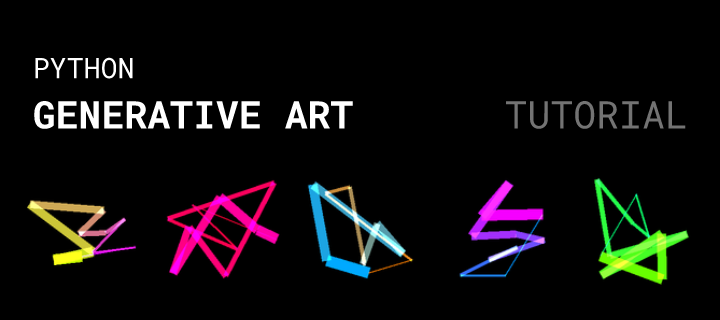

# Python Generative Art Tutorial



This is a tutorial for creating generative abstract art-work using Python. It is based on a generative art NFT collection I created earlier, called [Machine Psychology](https://www.mach-psy.com/) ([source](https://github.com/pixegami-team/machine-psychology-python-art)). But this tutorial project is simplified and only focuses on using Python to create the image.

## Usage

First make sure you have PIL installed.

```bash
pip install pillow
```

You can run it like this.

```bash
  # The above command will create a directory "Art Gallery" and a child Directory named "sample". Inside the "sample" directory the art image of size 1024 x 1024 will be generated and stored.
  python Generate_Art.py -n 32 --gallery "sample" --size 1024 --l 15
```

It should generate an image like this:

<a href = "https://github.com/srajan-kiyotaka/NFT-Generative-Art-using-Python/blob/master/Art%20Gallery/sample/sample_image_12.png">

</a>

<a href = "https://github.com/srajan-kiyotaka/NFT-Generative-Art-using-Python/blob/master/Art%20Gallery/sample/sample_image_2.png">

</a>

<a href = "https://github.com/srajan-kiyotaka/NFT-Generative-Art-using-Python/blob/master/Art%20Gallery/srajan/srajan_image_0.png">

</a>

<a href = "https://github.com/srajan-kiyotaka/NFT-Generative-Art-using-Python/blob/master/Art%20Gallery/sample/sample_image_31.png">

</a>

<a href = "https://github.com/srajan-kiyotaka/NFT-Generative-Art-using-Python/blob/master/Art%20Gallery/sample/sample_image_13.png">

</a>

<a href = "https://github.com/srajan-kiyotaka/NFT-Generative-Art-using-Python/blob/master/Art%20Gallery/sample/sample_image_18.png">

</a>
